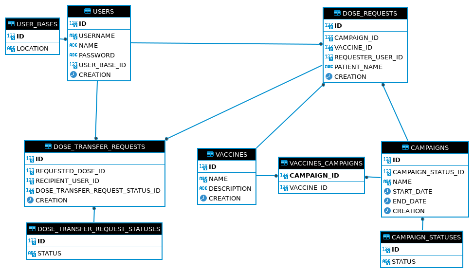
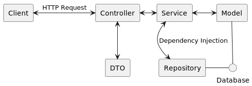

# Bootcamp NextGen 2022 - Sistema de Vacinação - Back End

---

## Requisitos

* Git
* Java JDK 11
* Maven 3.8.6

## Rodando Localmente o Projeto

Para rodar o Projeto localmente é necessário que o Java JDK 11 esteja instalado na máquina.
(seja o OpenJDK ou o da Oracle).


### Realizando o Build do projeto

O projeto utiliza o Maven como gerenciador de dependências e ferramenta de Build. Todas as principais depenências 
já estão no arquivo `pom.xml`, você, em tese, não precisará adicionar outras dependências.

Parara realizar o build a partir do terminal basta utilizar o comando:

`./mvnw install`

Para realizar os testes:

`./mvnw test`

E para rodar o projeto que ficará disponível em `localhost:8080`:

`./mvnw spring-boot:run`

Ou você pode usar as ferramentas de Build e Run da sua IDE (Eclipse, Netbeans, IntelliJ, etc)


## Banco de dados

O Banco de dados utilizado no Projeto é o H2, um banco de dados em memória do próprio SpringBoot.
Com o projeto em execução, você pode acessar o client WEB para o H2 na seguinte URL:

`http://localhost:8080/h2-console/`

Com as credenciais de acesso:

```agsl
user: sa
password: (em branco)
```
Caso profira, você também pode se conectar ao banco utilzando outro software cliente SQL como 
o Dbeaver (Note que o projeto deve estar rodando para acessar o banco). A string de conexão para o banco é:

`jdbc:h2:mem:mock_db`

### Massa de dados Inicial

O esquema do banco de dados e uma Massa de dados inicial podem ser encontrados nos arquivos `schema.sql` e
`data.sql` em `resources`. Por se tratar de um banco de dados em memória, ele é destruído sempre que 
o SpringBoot para de executar e recriado (a partir dos arquivos sql) sempre que ele volta a ser executado. 
Caso você queira aumetar a massa de daddos para realizar testes (altamente recomendado) você pode fazer isso
alterando o arquivo `data.sql`.

A massa de dados oficial já contém 3 usuários: `yurameshi`, `kkuwabara`, `ykurama`. A senha para todos é
`123456`

### Estrutura do banco de dados

O diagrama entidade-relacionamento do banco:



---


### Testes Manuais com Postman

Para a realização de testes manuais (isso não exclui a criação de testes automatizados), foi
disponibilizada uma coleção do Postman que já possui as requisições que já estão implementadas.


## Arquitetura do Projeto

A Arquitetura base do Projeto pode ser vista no seguinte diagrama:


---

* **Controller**: Camada responsável por receber as requisições HTTP do cliente. Utiliza a camada de DTO para
transformar os dados para os formatos de entrada e saída da applicação e delega as operações para a camada de Service.
* **DTO**: Formatos de entrada e saídas expostos pelo sistema.
* **Service**: Camada responsável por fazer as validações necessárias e executar as regras acessando o banco
através da camada Repository
* **Repository**: Camada para realização de consultas ao banco de dados.
* **Model**: Modelagem das Entidades de Negócio e realização de persistência no banco de dados.

### Autenticação

O projeto foi implementado uma autenticação *Basic* e *Stateless*, logo toda requisição que necessite
de autenticação deverá conter o cabeçalho.

`Authorization: Basic <token>`

Para gerar o `token` para o usuário foi disponibilizada uma rota de autenticação:

`POST localhost:8080/auth`

que recebe no corpo da requisição um `JSON`:
```agsl
{
    "username": ,
    "password":
} 
```